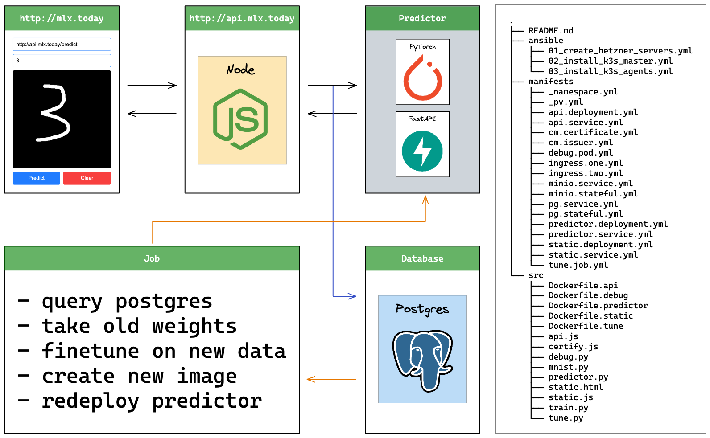
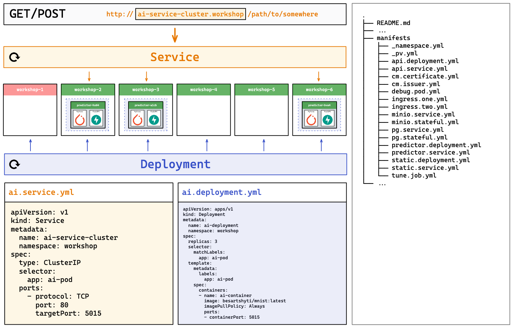
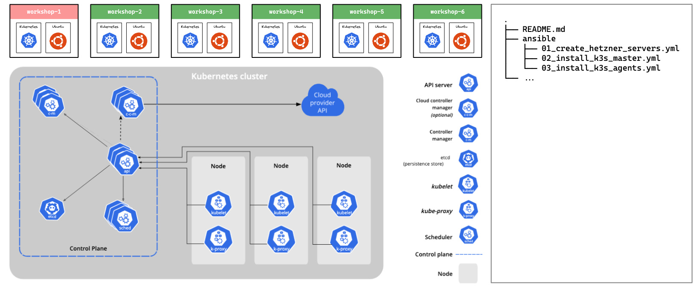

## k3s



First, we will create a cluster. The commands below to exactly that,
create a bare bone cluster with nothing in it but ready to run containers.

```sh
$ conda create --name k3s-workshop python=3.12.4 -y
$ conda activate k3s-workshop
$ which pip # ensure you are using "pip" inside the conda env
$ conda install -c conda-forge nodejs postgresql -y
$ pip install ansible PyYAML requests python-dateutil torch numpy torchvision Flask psycopg2-binary minio
$ ansible-galaxy collection install hetzner.hcloud # new ansible has already hetzner
$ curl -LO "https://dl.k8s.io/release/v1.30.2/bin/darwin/arm64/kubectl"
$ chmod +x kubectl
$ mv kubectl /Users/besartshyti/miniconda3/envs/k3s-workshop/bin/kubectl
$ export PATH="/Users/besartshyti/miniconda3/envs/k3s-workshop/bin:$PATH"
$ which kubectl # if this still points to "/usr/local/bin/kubectl" reactivate conda
# /Users/[unix]/miniconda3/envs/k3s-workshop/bin/kubectl
$ source .env && cd ansible # make sure to activate .env
$ ssh-keygen -t rsa -b 4096 -C "foo@bar.com" -f ./k3s_workshop -N ""
$ ansible-playbook 01_create_servers.yml
$ ansible-playbook -i hosts.ini 02_install_k3s_master.yml
$ ansible-playbook -i hosts.ini 03_install_k3s_agents.yml
# open workshop_config and change clusters[0].server
# to the actual master ip address
$ cd ../ && export KUBECONFIG="$(pwd)/ansible/workshop.config"
$ kubectl get nodes
# NAME             STATUS   ROLES                  AGE   VERSION
# k3s-workshop-1   Ready    control-plane,master   13m   v1.29.6+k3s2
# k3s-workshop-2   Ready    <none>                 13m   v1.29.6+k3s2
# k3s-workshop-3   Ready    <none>                 12m   v1.29.6+k3s2
# k3s-workshop-4   Ready    <none>                 12m   v1.29.6+k3s2
# k3s-workshop-5   Ready    <none>                 12m   v1.29.6+k3s2
# k3s-workshop-6   Ready    <none>                 12m   v1.29.6+k3s2
```

That's great we have our cluster up and running. Time to deploy
our system one container at a time.

```sh
$ kubectl apply -f manifests/_namespace.yml
$ kubectl apply -f manifests/static.deployment.yml
$ kubectl apply -f manifests/static.service.yml
$ kubectl apply -f manifests/ingress.one.yml
$ open http://65.108.241.188  # pick a random IP address from /hosts.ini
```

Static is done! Albait is the simplest component give its job
is just running a node.js server which returns some html/css/js.

Let's carry on with the rest of the components which will require
more work.

```sh
# api
$ kubectl apply -f manifests/api.deployment.yml
$ kubectl apply -f manifests/api.service.yml
# postgres - start database
$ kubectl apply -f manifests/_pv.yml
$ kubectl apply -f manifests/pg.stateful.yml
$ kubectl apply -f manifests/pg.service.yml
# postgres - connect and create table
$ kubectl port-forward svc/pg-service 5432:5432 -n workshop
$ ./scripts/database.sh
# predictor
$ kubectl apply -f manifests/predictor.deployment.yml
$ kubectl apply -f manifests/predictor.service.yml
$ open http://65.108.241.188 # boom! :)
```

The base model now is deployed. However very likley improvements
will be made and a new model should be deployed. The followings
are the steps to set up a job to do just that.

```sh
$ kubectl create configmap tune-kube-config --from-file=config=$KUBECONFIG -n workshop
```

```sh
$ kubectl create secret docker-registry tune-docker-config \
  --docker-server=https://index.docker.io/v1/              \
  --docker-username=besartshyti                            \
  --docker-password=$DOCKER_HUB_PASSWORD                   \
  --docker-email=besartshyti@gmail.com                     \
  --namespace=workshop
```

```sh
$ kubectl apply -f manifests/minio.stateful.yml
$ kubectl apply -f manifests/minio.service.yml
$ kubectl port-forward svc/minio-service 9000:9000 9090:9090 -n workshop
$ python ./src/train.py # only needed to upload the weights to Minio
$ kubectl apply -f manifests/tune.job.yml
```

In order to use https we need certificates. We will use cert-manager
with letsencrypt. First by creating an Issuer and then a Certificate.

```sh
$ kubectl apply -f https://github.com/cert-manager/cert-manager/releases/download/v1.15.1/cert-manager.yaml
$ kubectl apply -f manifests/cm.issuer.yml
$ kubectl apply -f manifests/cm.certificate.yml
$ kubectl apply -f manifests/ingress.two.yml
```

## Service



## Ansible


